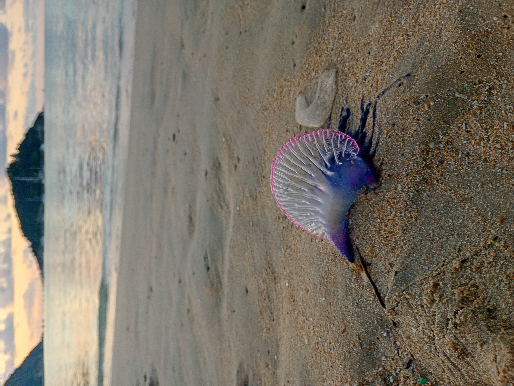
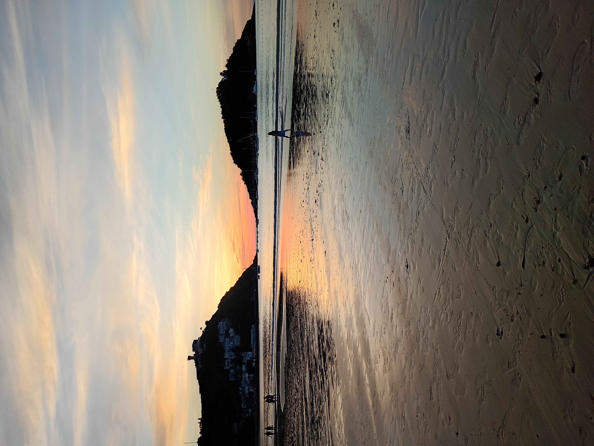
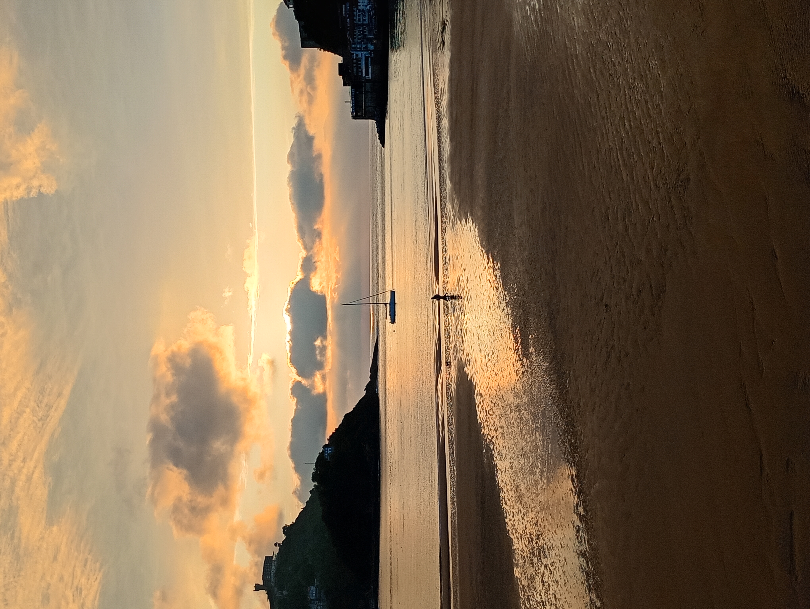
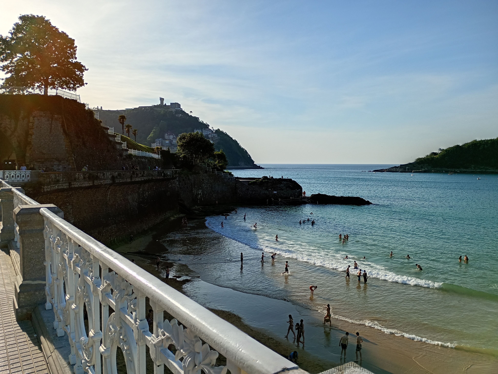
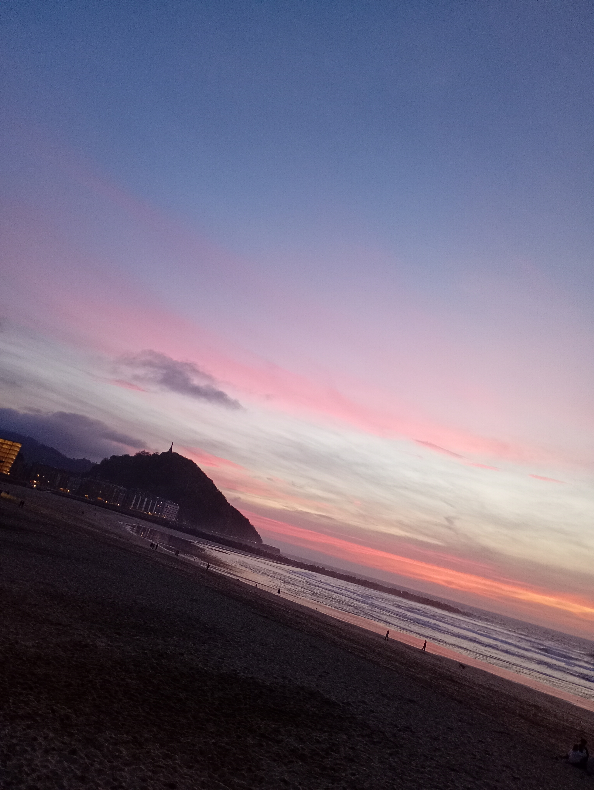
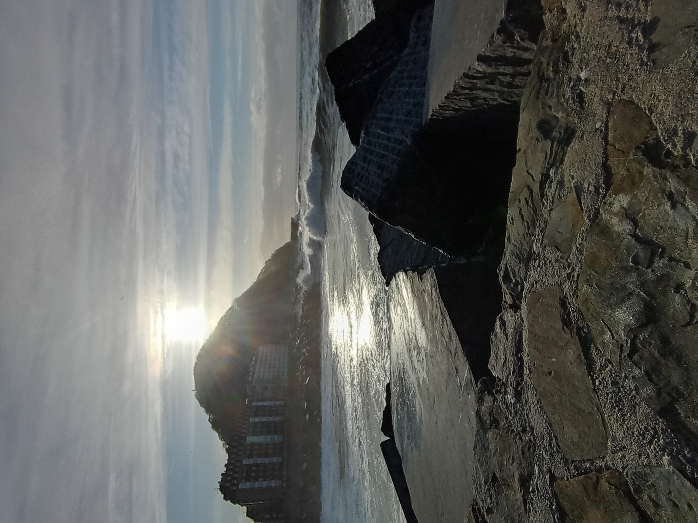
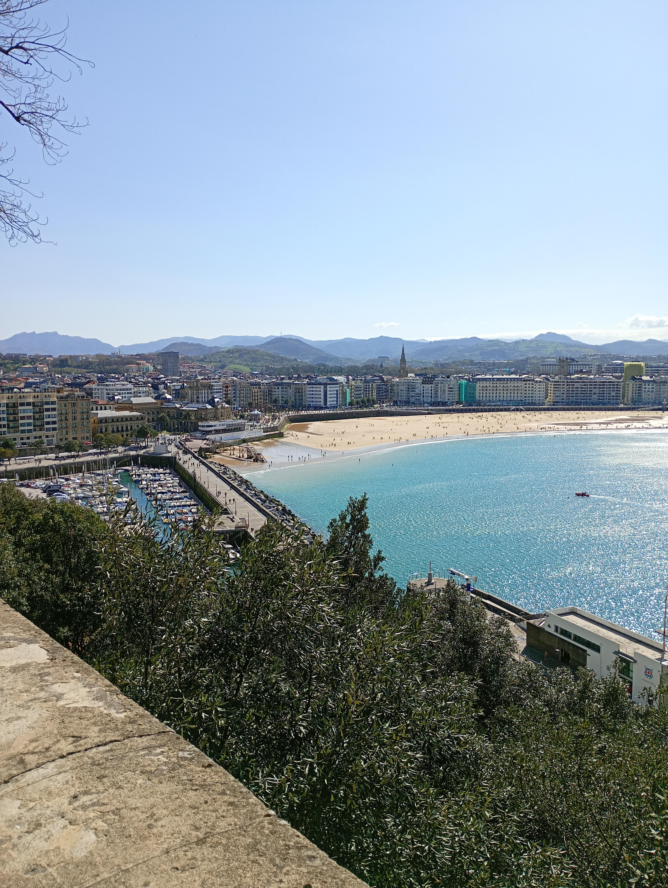

<html lang="en">
<head>
  <meta charset="UTF-8">
  <title>Masonry Gallery with Zoom</title>

  <!-- Bootstrap -->
  <link href="https://cdn.jsdelivr.net/npm/bootstrap@5.3.0/dist/css/bootstrap.min.css" rel="stylesheet">

  <!-- Lightbox CSS -->
  <link href="https://cdn.jsdelivr.net/npm/lightbox2@2/dist/css/lightbox.min.css" rel="stylesheet">

  
</head>

<body>

  <!-- FIXED -->
  

    
    
    

    
    
    

    

    

    

    

    

    

        
  

<!-- Lightbox JS -->

</body>
</html>

